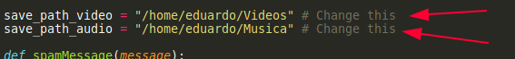

# YouTube Downloader

Hey guys, this is a simple program written in python3 that downloads video or audio from YouTube. I made this script inspired on Projeto_garcom of [@SrBorges](https://github.com/SrBorges)

You can see it here: [Projeto_garcom](https://github.com/SrBorges/Projeto_garcom)

## REQUIREMENTS

* `python3`

* `pytube` module
	- `pip3 install pytube3 --upgrade`

* `tkinter`
	- Comes by default with python

Before run the program, you **should** change the directory folder where the files .mp3 and .mp4 will be saved

## AN IMPORTANT THING

**YOU SHOULD USE THIS URL**

**DONT USE ANY OTHER LINK**

